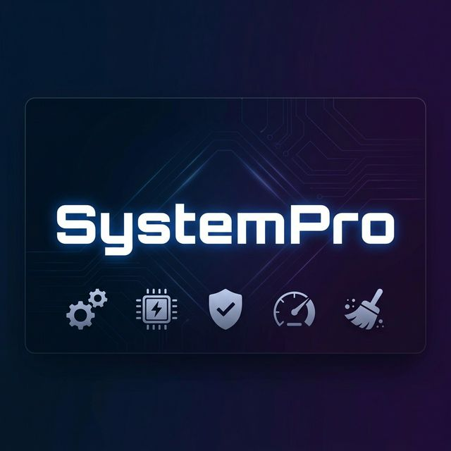
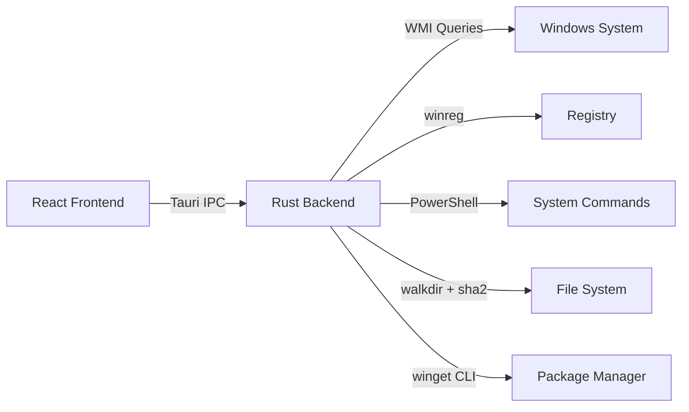

<p align="center">
  
</p>

<h1 align="center">SystemPro</h1>

<p align="center">
  <b>⚡ The Open-Source PC Optimizer That Actually Works</b>
  <br />
  <sub>40+ real system tools · Rust-powered performance · Zero telemetry · Free forever</sub>
</p>

<p align="center">
  <a href="https://github.com/vuckuola619/syspro/releases/latest"></a>
  
  
  
  
</p>

<p align="center">
  <a href="#-features">Features</a> ·
  <a href="#-architecture">Architecture</a> ·
  <a href="#-installation">Installation</a> ·
  <a href="#️-build-from-source">Build</a> ·
  <a href="#-tech-stack">Tech Stack</a> ·
  <a href="#-contributing">Contributing</a>
</p>

---

## 🎯 Why SystemPro?

Most PC optimizers are closed-source, bloated with ads, and run fake scans to scare you into paying. **SystemPro is different.**

Every operation is **real** — backed by native Windows APIs, WMI queries, and Rust system calls. No fake progress bars. No scare tactics. No upsells. Just tools that work.

| | SystemPro | CCleaner | Advanced SystemCare | Glary Utilities |
|:---|:---:|:---:|:---:|:---:|
| **Open Source** | ✅ | ❌ | ❌ | ❌ |
| **No Ads / Bloatware** | ✅ | ❌ | ❌ | ❌ |
| **No Telemetry** | ✅ | ❌ | ❌ | ❌ |
| **Real System Operations** | ✅ | ✅ | ⚠️ | ⚠️ |
| **Native Performance** | ✅ Rust | ❌ C++ | ❌ C# | ❌ Delphi |
| **Modern UI** | ✅ React | ⚠️ | ⚠️ | ⚠️ |
| **Free Forever** | ✅ | Freemium | Freemium | Freemium |
| **40+ Tools** | ✅ | ~10 | ~20 | ~20 |

---

## ✨ Features

SystemPro ships with **40+ integrated tools** organized into 7 categories:

<table>
<tr>
<td width="50%" valign="top">

### 🧹 System Cleaning

| Tool | Description |
|:-----|:------------|
| **Junk Cleaner** | Temp files, browser cache, logs, thumbnails |
| **Privacy Eraser** | Chrome, Edge & Firefox history, cookies, tracking data |
| **Registry Cleaner** | Orphaned COM entries, stale uninstall keys, broken file associations |
| **Duplicate Finder** | SHA-256 hash-based duplicate file detection |
| **One-Click Optimize** | Run all cleaners in a single operation |

</td>
<td width="50%" valign="top">

### ⚡ Performance

| Tool | Description |
|:-----|:------------|
| **Live Monitor** | Real-time CPU, RAM, disk & network graphs |
| **Startup Manager** | Enable/disable startup programs + context menu |
| **Performance Monitor** | Process list with memory optimization |
| **Disk Defragmenter** | Analyze & optimize drive fragmentation |
| **Turbo Boost** | One-click performance optimization mode |
| **Benchmarks** | System performance benchmarking suite |

</td>
</tr>
<tr>
<td width="50%" valign="top">

### 🔧 System Tools

| Tool | Description |
|:-----|:------------|
| **Driver Updater** | Real hardware driver scanning via WMI |
| **Software Updater** | Update apps via `winget` integration |
| **App Uninstaller** | Clean uninstall + leftover scanner |
| **Disk Analyzer** | Visual disk usage breakdown by folder |
| **System Info** | Comprehensive hardware & OS information |
| **Service Manager** | Windows services control panel |

</td>
<td width="50%" valign="top">

### 🛡️ Security & Privacy

| Tool | Description |
|:-----|:------------|
| **File Shredder** | 3-pass DoD-standard secure deletion |
| **File Hider** | Hide sensitive files from view |
| **Firewall Manager** | Windows Firewall rule management |
| **Privacy Hardening** | System-wide privacy settings |
| **Password Generator** | Cryptographic random password generation |
| **Popup Blocker** | Block unwanted system popups |

</td>
</tr>
<tr>
<td width="50%" valign="top">

### 🌐 Network

| Tool | Description |
|:-----|:------------|
| **Internet Booster** | DNS latency tester + one-click DNS changer |
| **Speed Test** | Network speed measurement |
| **Speed Monitor** | Real-time bandwidth monitoring |
| **Network Monitor** | Connection & adapter overview |

</td>
<td width="50%" valign="top">

### 🪟 Windows

| Tool | Description |
|:-----|:------------|
| **Windows Debloater** | Remove pre-installed Windows bloatware |
| **Windows Tweaks** | Hidden Windows optimizations |
| **Edge Manager** | Microsoft Edge settings & policies |
| **Hosts Editor** | System hosts file editor |
| **System Slimming** | Reduce Windows footprint |

</td>
</tr>
<tr>
<td width="50%" valign="top">

### 🔄 Maintenance

| Tool | Description |
|:-----|:------------|
| **Scheduled Cleaning** | Automate cleanup via Task Scheduler |
| **Restore Points** | System restore point management |
| **Registry Defrag** | Compact the Windows Registry |
| **Update Manager** | Windows Update management |

</td>
<td width="50%" valign="top">

### 🛠️ Utilities

| Tool | Description |
|:-----|:------------|
| **File Splitter** | Split large files into chunks & rejoin |
| **Disk Health** | S.M.A.R.T. disk health monitoring |
| **Settings** | App configuration & preferences |

</td>
</tr>
</table>

---

## 🏗️ Architecture

```
SystemPro/
├── src/                          # React 19 Frontend
│   ├── App.tsx                   # Router with 40+ routes
│   ├── pages/                    # Feature pages (one per tool)
│   ├── components/
│   │   ├── layout/               # App shell, sidebar, titlebar
│   │   └── ui/                   # Reusable components (Radix + shadcn)
│   ├── context/                  # React context providers
│   └── lib/                      # Utilities & helpers
│
├── src-tauri/                    # Rust Backend
│   ├── src/
│   │   ├── lib.rs                # Tauri commands & system operations
│   │   └── main.rs               # Application entry point
│   ├── capabilities/             # Tauri v2 permission capabilities
│   ├── tauri.conf.json           # App configuration
│   └── Cargo.toml                # Rust dependencies
│
├── index.html                    # Vite entry point
├── package.json                  # Node.js dependencies
├── tailwind.config.js            # Tailwind CSS configuration
├── vite.config.ts                # Vite build configuration
└── tsconfig.json                 # TypeScript configuration
```

### How It Works



The frontend communicates with the Rust backend through **Tauri's IPC bridge**. Each tool invokes one or more Rust commands that perform real system operations:

- **WMI** — Hardware info, driver data, disk health (S.M.A.R.T.)
- **winreg** — Registry scanning, cleaning, and optimization
- **PowerShell** — System operations that require elevated access
- **sysinfo** — Live CPU, RAM, disk, and network metrics
- **walkdir + sha2** — File system traversal and duplicate detection
- **winget** — Software update discovery and installation

---

## 📥 Installation

### Download (Recommended)

1. Go to [**Releases**](https://github.com/vuckuola619/syspro/releases/latest)
2. Download `SystemPro_1.0.0_x64-setup.exe`
3. Run the installer and follow the prompts
4. Launch SystemPro 🎉

### System Requirements

| Requirement | Minimum |
|:---|:---|
| **OS** | Windows 10/11 (64-bit) |
| **RAM** | 4 GB |
| **Disk Space** | ~50 MB |
| **Runtime** | WebView2 (included in Windows 10 1803+) |

---

## 🛠️ Build from Source

### Prerequisites

| Tool | Version | Install |
|:---|:---|:---|
| **Node.js** | ≥ 18 | [nodejs.org](https://nodejs.org) |
| **Rust** | ≥ 1.70 | [rustup.rs](https://rustup.rs) |
| **Tauri CLI** | v2 | `cargo install tauri-cli --version "^2"` |

### Build Steps

```bash
# Clone the repository
git clone https://github.com/vuckuola619/syspro.git
cd syspro

# Install Node.js dependencies
npm install

# Run in development mode (hot reload)
npm run tauri dev

# Build production installer
npm run tauri build
```

The built installer will be at:
```
src-tauri/target/release/bundle/nsis/SystemPro_1.0.0_x64-setup.exe
```

---

## 🧰 Tech Stack

<p align="center">
  
  
  
  
  
  
</p>

| Layer | Technology | Purpose |
|:---|:---|:---|
| **Desktop Runtime** | [Tauri v2](https://v2.tauri.app/) | Lightweight native wrapper with IPC |
| **Backend** | [Rust](https://www.rust-lang.org/) | System operations, memory safety, performance |
| **Frontend** | [React 19](https://react.dev/) | Component-based UI with hooks |
| **Type System** | [TypeScript 5.9](https://typescriptlang.org/) | Type-safe frontend development |
| **Styling** | [Tailwind CSS 3.4](https://tailwindcss.com/) | Utility-first CSS framework |
| **Components** | [Radix UI](https://www.radix-ui.com/) + [shadcn/ui](https://ui.shadcn.com/) | Accessible, composable UI primitives |
| **Charts** | [Recharts](https://recharts.org/) | Real-time data visualization |
| **Bundler** | [Vite 8](https://vitejs.dev/) | Lightning-fast HMR & builds |
| **Routing** | [React Router 7](https://reactrouter.com/) | Client-side page navigation |

### Key Rust Dependencies

| Crate | Purpose |
|:---|:---|
| [`sysinfo`](https://crates.io/crates/sysinfo) | CPU, RAM, disk, network, process metrics |
| [`winreg`](https://crates.io/crates/winreg) | Windows Registry read/write operations |
| [`walkdir`](https://crates.io/crates/walkdir) | Recursive directory traversal |
| [`sha2`](https://crates.io/crates/sha2) | SHA-256 hashing for duplicate detection |
| [`serde`](https://crates.io/crates/serde) | JSON serialization for frontend ↔ backend |

---

## 🤝 Contributing

Contributions are welcome! Here's how to get started:

1. **Fork** the repository
2. **Create** a feature branch: `git checkout -b feature/amazing-feature`
3. **Commit** your changes: `git commit -m "feat: add amazing feature"`
4. **Push** to the branch: `git push origin feature/amazing-feature`
5. **Open** a Pull Request

### Contribution Ideas

- [ ] 📸 Add screenshots to README
- [ ] 🔐 Code signing for release builds
- [ ] 🔌 Replace PowerShell commands with native WMI crate
- [ ] 🧪 Add automated tests (Vitest + Playwright)
- [ ] 🌙 Dark/Light theme toggle
- [ ] 🌍 Multi-language support (i18n)
- [ ] 🍎 macOS / Linux port

---

## ⚠️ Antivirus Notice

Some antivirus software may flag SystemPro as a **false positive** because it performs system-level operations like registry manipulation, file deletion, and scheduled task creation. This is common for PC optimization tools.

**SystemPro is 100% open source — you can audit every line of code.**

If flagged:
- 🔍 [Review the source code](src-tauri/src/lib.rs) yourself
- 📝 [Report the false positive](https://github.com/vuckuola619/syspro/issues) so we can investigate
- 🛠️ Build from source for full transparency

---

## 📄 License

This project is licensed under the **MIT License** — see the [LICENSE](LICENSE) file for details.

---

<p align="center">
  <sub>Built with ❤️ and Rust 🦀</sub>
  <br />
  <sub>If SystemPro helped you, consider giving it a ⭐</sub>
</p>
